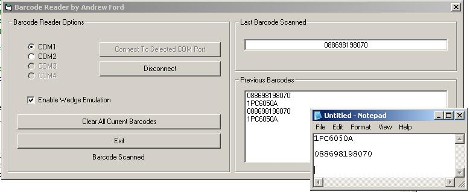



## Serial Barcode Reader

### Description

This project allows you to get a barcode from a serial barcode reader and put it into your applications, or another application using sendkeys. It uses the MSComm control and the OnComm event to read each individual character passed to the serial port, it detects the finished barcode from the carriage return sent by the barcode reader. This could be useful in epos programs or just to get data from the serial port.
 
### More Info
 

             |
---                |---
**Submitted On**   |2003-06-13 17:25:14
**By**             |[Andrew Ford](https://github.com/Planet-Source-Code/PSCIndex/blob/master/ByAuthor/andrew-ford.md)
**Level**          |Intermediate
**User Rating**    |4.8 (29 globes from 6 users)
**Compatibility**  |VB 6\.0
**Category**       |[Miscellaneous](https://github.com/Planet-Source-Code/PSCIndex/blob/master/ByCategory/miscellaneous__1-1.md)
**World**          |[Visual Basic](https://github.com/Planet-Source-Code/PSCIndex/blob/master/ByWorld/visual-basic.md)
**Archive File**   |[Serial\_Bar1630158152003\.zip](https://github.com/Planet-Source-Code/andrew-ford-serial-barcode-reader__1-47704/archive/master.zip)

